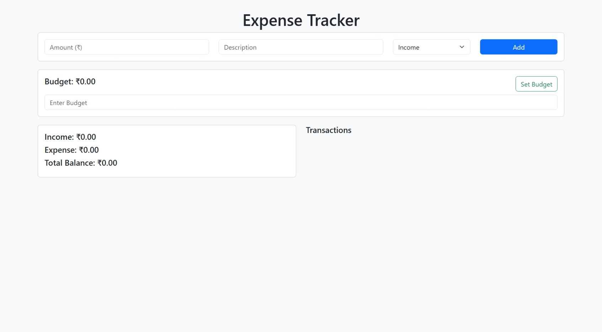

# Expense Tracker

A simple and easy-to-use web-based **Expense Tracker** built with **HTML**, **CSS**, and **JavaScript**. The app helps users track their income, expenses, and set a budget. It stores data locally using **LocalStorage**, so the data persists even after the page is refreshed.

## Features

- **Track Income & Expenses**: Add income or expense transactions.
- **Budget Tracking**: Set and view your budget.
- **Total Balance**: Automatically calculates the balance by subtracting expenses from income.
- **Transaction History**: View a history of all transactions.
- **Currency**: Displays amounts in **Indian Rupees (₹)**.
- **Responsive Design**: Optimized for both desktop and mobile devices.

## Tech Stack

- **Frontend**: 
  - HTML
  - CSS (with Bootstrap for responsive design)
  - JavaScript (for functionality)
- **Storage**: LocalStorage (to save transactions and budget)

## Demo

You can view the live demo of the project by visiting the deployed URL [Expense Tracker](https://expense-tracker-nu-lac.vercel.app/).

## Screenshots



## Installation & Setup

To run the **Expense Tracker** app locally on your machine, follow these steps:
2. Navigate to the project folder
`cd expense-tracker`

3. Open the index.html file
Open the index.html file in your browser (Chrome, Firefox, etc.)

The app should now be running on your local machine!

Usage
Add a Transaction:

Enter the amount, description, and select whether it's an Income or Expense.

Click "Add" to save the transaction. It will show up in the transaction history.

Set a Budget:

Enter the amount for your budget and click Set Budget.

The app will show your current budget along with your total income and expenses.

View Transaction History:

All your past transactions will be listed with the option to delete them.

Track Income, Expenses, and Balance:

The app will show your total income, expenses, and the balance after considering both.
### 1. Clone the repository

```bash
git clone https://github.com/karangowda06/Expense-Tracker.git
